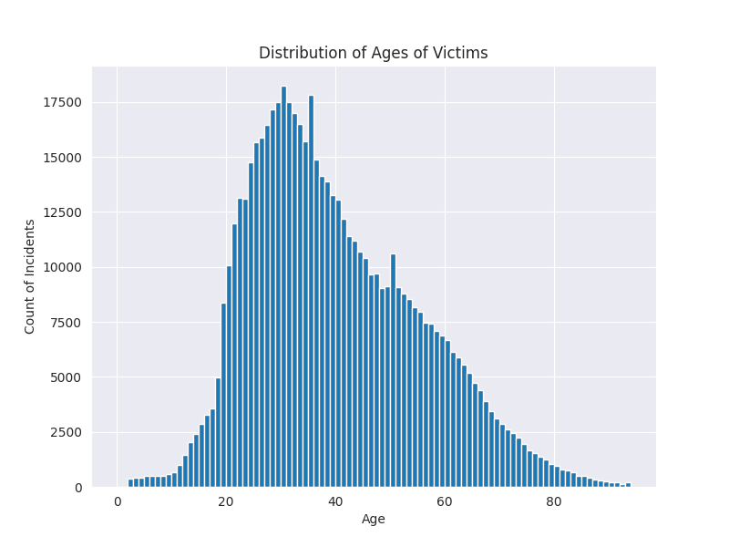

# python-data-science-template-v2

[](https://github.com/nogibjj/python-data-science-template-v2/actions/workflows/codespaces/create_codespaces_prebuilds) 

[](https://github.com/dhavalpotdar/descriptive-stats-using-ci/actions/workflows/install.yml)

[](https://github.com/dhavalpotdar/descriptive-stats-using-ci/actions/workflows/format.yml)

[](https://github.com/dhavalpotdar/descriptive-stats-using-ci/actions/workflows/lint.yml)

[](https://github.com/dhavalpotdar/descriptive-stats-using-ci/actions/workflows/test.yml)

***

This project demonstrates the benifits of using Continuous Integration for Data Science projects. The CI pipeline ensures that code that is pushed to the main branch upholds code quality both in term of functionality and formatting. It also provdes a hosted environment which is equivalent to the local. 

## Code
The repo has the following code files:
- `main.py`: Generates the descriptive statistics and plots, and stores them into the `/output` folder. 
- `lib.py`: Holds the library funtions that are shared between `main.py` and `desc_stats.ipynb`.
- `desc_stats.py`: Prints out the descriptive stats and plots using the functions in `lib.py`.
- `test_lib.py`: Testcases for the functions in `lib.py`.
- `test_main.py`: Testcases for the functions in `main.py`.

## Build

Run the following commands to setup the environment/run the code.
```
make install
make lint
make format
make test
make run
```

`make run` executes the `main.py` and stores the results in `outputs` directory.

## Results


Descriptive statistics can be found [here](outputs/DESC_STATS.md).


